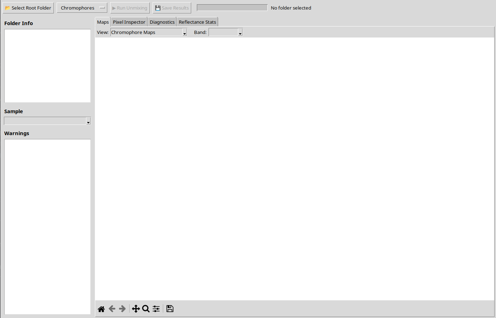
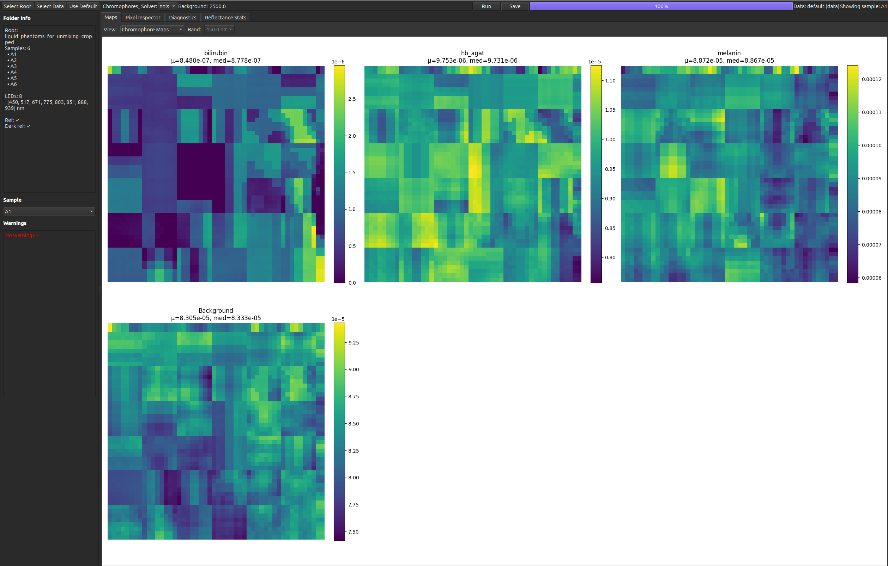

# Spectral Unmixing Application

[](https://github.com/mkuziuk/spectral-unmixing/releases/latest)

<div align="center">


</div>

A biomedical hyperspectral desktop application that processes raw multidimensional image cubes to automatically compute reflectance, optical density, and finally chromophore concentration maps.

By providing an intuitive, minimal Graphical User Interface (GUI), this application allows analyzing samples without deep coding knowledge.

## Release 0.2.2

Release `0.2.2` removes the legacy tkinter rollback path and keeps **PySide6** as the single supported desktop UI.

- `python app/main.py` launches the PySide6 application directly
- the old `--legacy-tk` flag and `SPECTRAL_UNMIXING_LEGACY_TK` environment fallback are no longer supported
- release packaging and documentation now target the Qt application only

## Capabilities

* **Automated Data Processing**: Point the application to a root directory containing subfolders for each raw sample alongside reference (`ref/`) and dark-current (`dark_ref/`) folders. 
* **Reflectance and Optical Density Extractor**: Performs pixelwise calculation from raw spectral intensity data directly.
* **Complex Overlap Matrix formulation**: Automatically loads target absorption spectra (`data/chromophores/`). It creates an inclusive physical model handling LED bandwidth and wavelength-dependent penetration depth.
* **Fast Spectral Unmixing**: Employs an exact simple least-squares mathematical model completely vectorized over pixel dimensions, enabling fast solving per image.
* **Dynamic Component Tracking**: Automatically identifies and extracts critical chromophores based on the contents of the `data/chromophores/` directory. Users can flexibly add or alter unmixing targets (such as HbO₂, Hb, Melanin, Bilirubin, and Water) simply by dropping custom `.csv` spectra files into this folder without needing to modify the codebase.
* **Custom Data Folder Selection**: Users can select a custom data folder via the UI to support different experimental setups or shared reference data. The application validates the folder structure and provides clear error messages for missing required files.
* **Derived Quality Metrics**: Computes aggregate metrics such as Total Hemoglobin (THb) and Oxygen Saturation (StO₂).
* **Statistical Analysis**: View summary statistics (mean and median reflectance) per hyperspectral cube across all wavelength bands.
* **Interactive Data Inspector Panel**: Includes visual diagnostics and an interactive pixel inspector—allowing you to click on any pixel in the loaded cube to see measured versus fitted optical density spectra, estimated concentrations, residuals, and general pixel RMSE.
* **Exporting**: Save unmixed component maps (.png), raw arrays (.npy or .csv) and metadata back to your file system.

## The Math and Physics Model

At its core, the unmixing engine translates pixel intensities at varied light wavelengths to specific chromophore densities. 

### 1. Reflectance ($R$)
Using specific `ref/` and `dark_ref/` reference images, the pixelwise directional tissue reflectance is computed:

$$
R(i,j,\lambda) = \frac{I(i,j,\lambda) - I_{\text{dark}}(i,j,\lambda)}{I_0(i,j,\lambda) - I_{\text{dark}}(i,j,\lambda)}
$$

### 2. Optical Density ($OD$)
Optical density transitions logarithmic-scaled reflectance representations ensuring linear dependence during subsequent fitting:

$$
OD(i,j,\lambda) = -\log_{10}(R(i,j,\lambda) + \varepsilon)
$$

### 3. Spectral Overlap Integration Formulation
Standard pseudo-inverse models assume pure monochromatic illumination. Since LEDs possess inherent energy distribution bandwidths, the engine evaluates spectral overlap integration dynamically:

* **Overlap Extinction Coefficient**: For a given LED ($n$) and individual chromophore ($k$): 

  $$\varepsilon_k^{(n)} = \int \phi_n(\lambda)\varepsilon_k(\lambda)d\lambda$$

* **Overlap Pathlength**: We modulate theoretical estimations via simulated wavelength-correlated penetration distributions $l(\lambda)$: 

  $$l^{(n)} = \int \phi_n(\lambda)l(\lambda)d\lambda$$

* **Overlap Component Matrix**: Building an inclusive linear target constraint formulation ($N_{LED} \times 5$ parameters): 

  $$A_{n,k} = l^{(n)} \cdot \varepsilon_k^{(n)}$$

  (Note: A base background row column is generally appended resulting in $N_{LED} \times 6$ mapping)

### 4. Least Squares Optimization
Treating the system as an unconstrained inverse linear function over the LED bands, minimizing pixelwise L2 distances:

$$
\mathbf{y} = \mathbf{A}\mathbf{x}
$$

Where $\mathbf{y}$ is the recorded OD on LED bands. Unmixing simply demands resolving:

$$
\hat{x} = \arg\min_x \lvert Ax - y\rvert_2^2
$$

---

## Installation Instructions

The application requires **Python 3.8+** and utilizes standard scientific and interface UI libraries (`numpy`, `scipy`, `matplotlib`, `pillow`, `PySide6`).

### Windows

1. **Install Python** (3.8 or newer) from [python.org](https://www.python.org/). *Ensure you check "Add Python to PATH" during installation.*
2. **Download/Clone** this repository and extract it to a preferred folder.
3. Open **Command Prompt** or **PowerShell** and navigate to the project directory.
4. Create a virtual environment:
   ```cmd
   python -m venv .venv
   ```
5. Activate the virtual environment:
   ```cmd
   .venv\Scripts\activate
   ```
6. Install required dependencies:
   ```cmd
   pip install -r requirements.txt
   ```
   *(Alternatively, install as a package: `pip install .`)*
7. Run the application:
   ```cmd
   python app/main.py
   ```

### macOS

1. **Install Python** (3.8 or newer) via [Homebrew](https://brew.sh/): `brew install python` or using the official installer. 
2. Open **Terminal** and navigate to the downloaded project footprint. 
3. Create a virtual environment:
   ```bash
   python3 -m venv .venv
   ```
4. Activate the virtual environment:
   ```bash
   source .venv/bin/activate
   ```
5. Install required dependencies:
   ```bash
   pip install -r requirements.txt
   ```
   *(Alternatively, install as a package: `pip install .`)*
6. Run the application:
   ```bash
   python app/main.py
   ```

### Linux (Ubuntu / Debian)

1. Ensure the base Python and virtual environment packages are installed:
   ```bash
   sudo apt update
   sudo apt install python3 python3-venv
   ```
2. Open your terminal emulator and navigate to the target directory.
3. Create a virtual environment:
   ```bash
   python3 -m venv .venv
   ```
4. Activate the virtual environment:
   ```bash
   source .venv/bin/activate
   ```
5. Install dependencies:
   ```bash
   pip install -r requirements.txt
   ```
   *(Alternatively install as a package: `pip install .`)*
6. **Execution**: You can either target the main application runner explicitly, or use the pre-packaged shell hook:
   ```bash
   ./run.sh
   # Or alternatively: python app/main.py
   ```

### Troubleshooting
If the Qt UI fails to launch, confirm that `PySide6` installed successfully in your active environment. On Linux, make sure your machine has the system display libraries needed by Qt and that you are starting the app inside a graphical session.

## Custom Data Folder Support

### Folder Structure Requirements

When selecting a custom data folder via the **🧪 Select Data Folder** button in the UI, the folder must contain the following structure:

```
custom_data_folder/
├── leds_emission.csv              # LED emission spectra (required)
├── penetration_depth*.csv         # Penetration depth data (required, see note below)
└── chromophores/                  # Directory with chromophore spectra (required)
    ├── HbO2.csv
    ├── Hb.csv
    └── ... (more .csv files)
```

**Required Files:**

| File | Description |
|------|-------------|
| `leds_emission.csv` | CSV with wavelength column and LED emission intensity columns |
| `penetration_depth*.csv` | Penetration depth vs. wavelength (at least one required) |
| `chromophores/` | Directory containing at least one `.csv` file with extinction coefficients |

**Penetration Depth File Selection:**
- If `penetration_depth_digitized.csv` exists, it will be selected automatically
- Otherwise, the lexicographically first `penetration_depth*.csv` file is chosen
- **Recommendation**: Use `penetration_depth_digitized.csv` for consistency when multiple options exist

### Basic Usage Flow

1. Launch the application: `python app/main.py`
2. Click **📂 Select Root Folder** to choose your sample data directory (containing image cubes, `ref/`, and `dark_ref/`)
3. Click **🧪 Select Data Folder** to choose a custom data folder with required files
4. Verify the data source label shows your custom folder
5. Select desired chromophores from the **Chromophores** menu
6. Adjust solver (LS/NNLS) and background value if needed
7. Click **▶ Run Unmixing** to process all samples
8. Use the tabs (Maps, Pixel Inspector, Diagnostics, Reflectance Stats, Chromophore Bar Charts) to view results
9. Click **💾 Save Results** to export component maps and arrays

### Common Errors and Solutions

| Error Message | Cause | Solution |
|---------------|-------|----------|
| `Required file 'leds_emission.csv' not found` | Missing LED emission file | Add `leds_emission.csv` to your data folder |
| `Required file 'penetration_depth*.csv' not found` | No penetration depth file | Add at least one `penetration_depth*.csv` file |
| `Required directory 'chromophores/' not found` | Missing chromophores directory | Create `chromophores/` and add `.csv` files |
| `Directory 'chromophores/' contains no .csv files` | Empty chromophores directory | Add at least one `.csv` file with extinction coefficients |
| `LED {wl} nm not found in ...` | Wavelength mismatch | Ensure LED wavelengths in `leds_emission.csv` match your image cube filenames |
